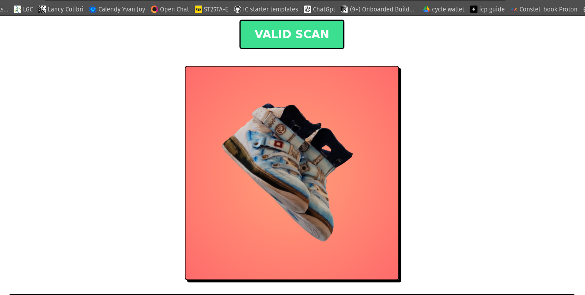

# Real Assets Virtually Extended (RAVE Assets)

 A RAVE asset is a Real Asset Virtually Extended through a canister smart contract. This allows for a seamless digital extension of physical items.  This is a new concept for associating real-world items with their digital twins using canister smart contracts on the Internet Computer (ICP).

This repository provides an example of a RAVE asset with a 3D model of space boots, demonstrating how a physical item can be represented and managed digitally.

These boots are real, and this repo is an example of the representation of these boots on ICP.

## Example Project

You can view the canister that represent the boots [here](https://5a3r2-iyaaa-aaaas-aabaa-cai.icp0.io/).

## The Potential of ICP

ICP, or Internet Computer, offers a unique approach to building decentralized applications through its canister smart contracts. These canisters function as mini servers or computers and are incredibly cost-effective to create.. This low cost unlocks vast potential for innovative applications.

One particularly exciting use case is the ability to connect a canister to a real-world asset, effectively creating a digital twin.

## NFC Technology

One of the most important aspects is to connect the real asset to its corresponding canister together:

The association of the shoe and the canister is done through an NFC (Near Field Communication) chip, the same technology used for payment card systems. Each shoe has an NFC chip, and the URL of the canister is encoded into the tag. When you scan the tag on the shoe with any smartphone, the NFC tag redirects to the canister smart contract and validates the authenticity of the scan, providing a very accessible experience to everyone.

## Valid Scan (accessing the canister via the scan of the NFC tag)

## Invalid Scan (accessing the canister via the url only)

